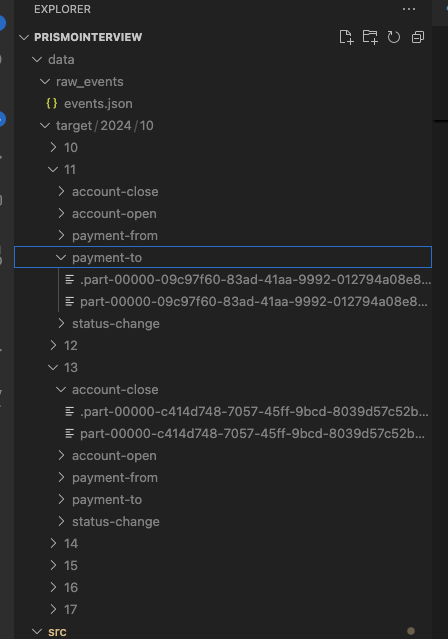
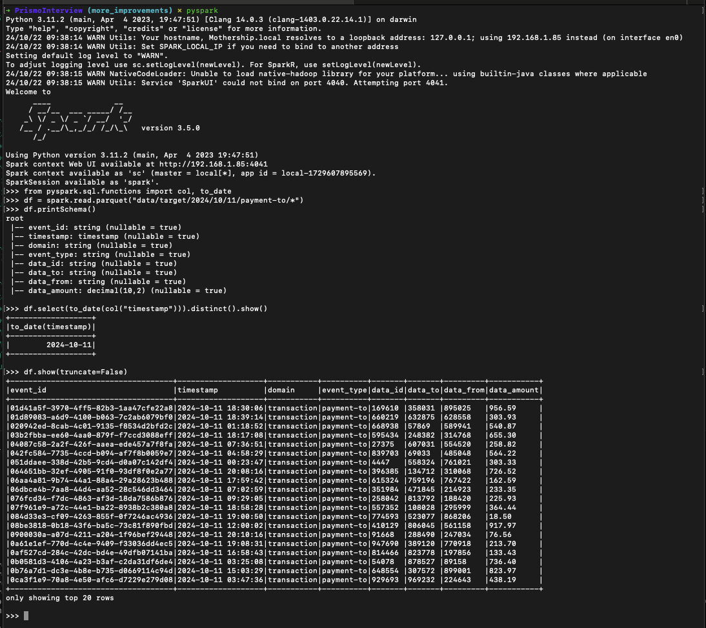

# PrismoInterview

My data pipeline simulation for Prismo

## Table of Contents
1. [Environment Setup](#environment-setup)
2. [Usage](#usage)
3. [Testing](#testing)
4. [Design](#design)
5. [Results](#results)
6. [Further Improvements](#further-improvements)

## Environment Setup
This was written and tested on a 2021 M1 MacbookPro using:
- Python 3.11.2
- Apache Spark 3.5.0
- PySpark 3.5.2

For MacOS:
```
brew install python@3.11
brew install apache-spark

git clone https://github.com/ecooklin/PrismoInterview.git

cd PrismoInterview
python3.11 -m venv venv
source venv/bin/activate
python -m pip install -r requirements.txt
```

## Usage

### Run Everything
I've included a `.sh` script to run everything all at once. This will produce 10k events and `backfill`s all dates generated. (Defaults to starting at `2024-10-10`). This writes to a `data/` directory.
```
cd PrismoInterview
chmod +x run_everything.sh
./run_everthing.sh
```

### 1. To run the `DataGenerator`:
```
python src/datagenerator.py --seed 123 --num-events 10000 --base-path data/raw_events/ --write-data
```

Arguments:
- `--seed`: The seed for the random data generator (default is 0).
- `--num-events`: The number of events to generate (default is 10).
- `--write-data`: (Optional) Boolean flag to write the generated data to a file.
- ` --base-path`: (Optional) Path to the directory where event data should be saved Default is `data/raw_events/`.

### 2. To run the `EventLoader`:
```
spark-submit eventloader.py --source-file data/raw_events/events.json --domain account --event-type status-change --date 2024-10-10 --target-path data/target/
```

Arguments:
- `--source-file`: Path to the source JSON file containing the events.
- `--target-path`: Directory to write the transformed parquet files. Default is `data/target/`.
- `--domain`: The domain of events to load (ex `account` or `transaction`).
- `--event-type`: The type of event to filter on (e.g., `account-open`, `account-close`, `status-change`, `payment-to`, `payment-from`).
- `--date`: The specific date (`YYYY-MM-DD`) to filter the event data.
- `--backfill`: (Optional) Load EVERYTHING from the `source-file` to the `target-path`

## Testing

You can run the tests using run_tests.py file or by calling `unittest` directly.

```
python run_tests.py
```

## Design 

### Challenge
Develop a solution to:
1. create a dataset of events
2. consume the created file
3. organize them into separate directories by event type.

Important Technical Notes
- Use Python or Scala.
- Output files should be in Parquet format.
- For duplicate events, keep only the latest version.
- In the output directory, use partitioning by event date (year, month, day) and event type.

### Solution
1. The `DataGenerator` module uses the Faker library to produce 3 types of `account` events and 2 types of `transaction` events with randomly generated payloads. If the `--write-data` flag is given, it will write the data to a JSON file specified in the `--base-path`

    #### Thoughts:
    To avoid over engineering the `DataGenerator` by sticking to two basic event domains - `account` and `transactions` as called out in the prompt. I created a few event types for each domain which should cover very basic operations for a financial domain. 

2. The `EventLoader` module uses PySpark to:
    1. read in a specified file
    2. Filter the events for a specified `domain` and `event-type`
    3. Filter all the events for the `target-date` given
    4. Flatten any nested struct columns and cast the dataframe according to an event schema in `src.models.event_schemas`
    5. Dedupe the Events by a row_number windowing over the `event_id` in desc order and only taking the first one
    6. Write the resulting dataframe to a specified directory

    #### Thoughts: 
    I designed the `EventLoader` imagining a batch loading process on a daily cadence. As the prompt says that we are ingesting a file and writing the file to parquet partitioned by the date in the timestamp. While the `spark-submit` command is verbose, this gives us fine control over the behavior of the `EventLoader`.

    For simplicity, I assume that we can specify and filter for the specific `domain` and `event-type` as this will allow us to apply a specific schema to each domain. I chose to flatten any nested structures to take advantage of the column level power of parquet format.

    The dedupe method is a costly but effective method of only returning the latest version of a given `event_id`. Since this is a UUID it *must* be unique, so it gives us a good variable to partition by.

    If we wanted to change this to an hourly ingestion, we will need to change the `mode` to `append` unless its in `backfill` mode.

3. Backfill mode - by adding the `--backfill` flag to the `eventloader.py` call, we can load all data for a specific `domain` and `event-type` to the specified `target-path`. This gives a simple, but costly way to read everything in and write everything to their respected partitions.

## Results
In the screenshot we can see that after running both the `datagenerator` and `eventloader` we have created an `events.json` file, and have filtered each event-type into parquets partitioned by their dates (`YYYY/MM/DD`).



Additionally we can load one of these parquets into a dataframe to inspect.



## Further Improvements
The work contained here is just a baseline of functionality that was described in the challenge. There are many directions we can take in order to improve this solution.

### Data Generator Improvements
- These are basic events used for testing. In practice, I would expect a bit more complexity in the event structures. 
- Right now each run will overwrite the file thats produced. This was done for simplicity and to ensure I didn't kill my disk space when testing. We could modify this behavior to append the events to the file or add a new file in the same directory.

### Event Loader Improvements
- This can be run hourly, but if we wanted to partition by the hour, we would need to extend the base classes to accomodate this.
- The `EventSchemas` class could get messy if dealing with more domains. The best practice would be to separate out all domain schemas into their own classes. Since I only simulated 2 domains, I kept them together for clarity.
- The final data is now resting in a directory, but for this to be usable in a DB or Data Warehouse, the data would have to be loaded in. 
- Add more testing scenarios

### Additional Modules to Simulate
- We could further add complexity by writing the corresponding Airflow DAG that could be used for orchestration.
